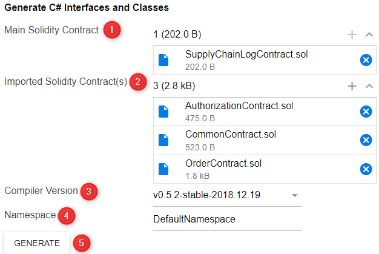
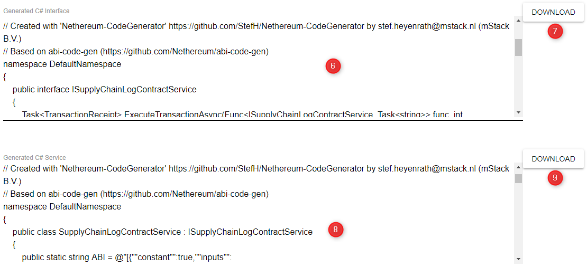

# Nethereum-CodeGenerator

A Nethereum Generator which creates a C# Interface and Service based on Solidity Smart Contracts.

## Demo

A demo is running at [stefh.github.io/Nethereum-CodeGenerator](https://stefh.github.io/Nethereum-CodeGenerator/#/generate).

## Usage

- (1) : Select the main Solidity Contract
- (2) : Optionally select the Solidity Contracts which are imported by the main Solidity Contract
- (3) : Select the compiler version
- (4) : Define the namespace you would like to use the generated C# interfaces and classes
- (5) : click the generate button
- (6) : The generated C# Interface is displayed here.
- (7) : Click the download button to download the C# interface.
- (8) : The generated C# Service is displayed here.
- (9) : Click the download button to download the C# service.





## Project setup

```cmd
npm install
```

### Compiles and hot-reloads for development

```cmd
npm run serve
```

### Compiles and minifies for production

```cmd
npm run build
```

### Compiles and minifies for github-pages

```cmd
npm run github
```

See also <https://cli.vuejs.org/guide/deployment.html>.

### Lints and fixes files

```cmd
npm run lint
```
